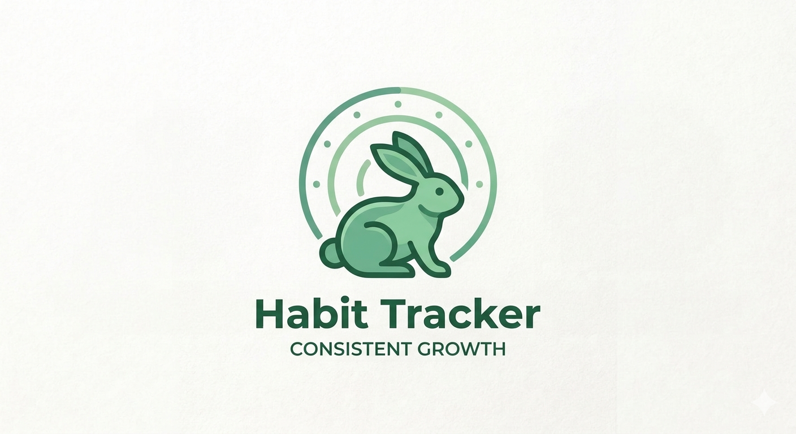

# Habit OS — Personal Productivity & Habit Operating System



<p align="center">
  <br>
  <b>A Minimalist, Local-First, High-Precision Productivity & Habit Operating System</b><br>
  Built with React, Vite, TypeScript, Dexie IndexedDB, and Electron for Standalone Desktop GUI Applications.
</p>

<p align="center">
  
  
  
</p>

---

## 🌟 Overview

**Habit OS** is an advanced, privacy-focused productivity workstation designed for professionals, engineers, and power users who demand high-density workflow management without slow cloud bloat or visual distraction.

Every surface follows a **Minimal Ink & Monochromatic Precision** visual language, storing 100% of user data locally inside your device using Dexie IndexedDB.

---

## 🚀 Key Capabilities & Modules

### 1. 📊 Habit Consistency Engine
- Track daily, weekly, or custom scheduled habits with target values and metrics.
- Dedicated Modal Creation Dialogs (**Add Habit Modal** with category, time of day, difficulty, and start/end dates).
- 30-day streak heatmaps, completion consistency percentages, and best-performing day metrics.
- Flexible streak skip rules (*Pause*, *Reset*, *Forgive*, *Break*).

### 2. 🎯 Tasks, Workload & Interactive Scheduling Calendar
- Workload management supporting backlog, todo, in-progress, and critical priority items.
- Dedicated Modal Task Dialogs (**Add Task Modal** with priority, due date, due time, estimated minutes, and tags).
- **Interactive Task Scheduling Calendar**: Month & week grid highlighting task deadlines, scheduled habits, and historical date inspection.

### 3. ⏱️ Verified Focus Engine (Anti-Gaming Protection)
- Multi-mode focus timers (**Guided Verification Mode**, **Continuous Mode**, **Goal-Based Focus**).
- Anti-gaming verification checkpoints: periodic verification prompts separate verified deep work from idle time.
- Interruption logging and session efficiency analytics.

### 4. 📈 Rich Visual Analytics & SVG Charts
- Multi-line 30-day trend graphs tracking habit completion % and verified focus curves.
- Task priority distribution donut/pie charts.
- 7-day focus minutes breakdown bar charts.

### 5. 🔥 Dynamic Flame Streak & Streak Freeze Shield
- **Top-Corner Dynamic Flame Indicator**: Red glow (100% completion), Orange (50%), Yellow (25%), White/Dim (10%), with ticking & burst animation on login if 0% progress.
- **Streak Freeze Shield**: Earn 1 Streak Freeze after 5 consecutive days of 100% activity. Protects your streak for 24 hours if a day is missed, featuring an animated melting ice sequence.

### 6. 🧠 Context-Aware AI Analyst & Master Password Security
- Integrates **Ollama Local Base AI** (`http://localhost:11434`), **NVIDIA NIM**, OpenAI (GPT-4o), Anthropic Claude 3.5, Google Gemini, and 100% Offline Engine.
- **Master App Password**: Password-protected **Clear Entire Database** and JSON data backup extraction in Settings.

---

## 💻 Installation & Setup Guide

Habit OS can be installed either as a **Direct Standalone Desktop App** or via **Automated Python CLI Setup**.

---

### Method 1: Direct Desktop App Installation (Recommended)

Run Habit OS directly as a standalone desktop application with a GUI icon:

1. Navigate to the latest **Releases** section on GitHub.
2. Download the pre-packaged executable for your operating system:
   - **Windows**: `Habit.OS.Setup.1.0.0.exe` (Installer) or `Habit.OS.1.0.0.Portable.exe` (Standalone)
   - **Linux**: `Habit_OS-1.0.0.AppImage` (Executable) or `habit-os_1.0.0_amd64.deb` (Debian Package)
   - **macOS**: `Habit_OS-1.0.0.dmg` (Disk Image Installer)
3. Launch the application directly via your desktop icon or start menu shortcut.

---

### Method 2: Command-Line CLI Setup & Build (Cross-Platform)

Follow these steps to set up the development environment, clone the repository, and perform the initial build.

#### 1️⃣ Environment Prerequisites & System Dependencies

Ensure **Python** (3.8+), **Node.js** (v18+ LTS), and **Git** are installed.

##### 🐧 Linux (Ubuntu / Debian / Kali / Arch)
```bash
# Ubuntu / Debian / Kali
sudo apt update
sudo apt install -y python3 python3-pip python3-venv nodejs npm git build-essential

# Arch Linux
sudo pacman -S python python-pip nodejs npm git base-devel
```

##### 🪟 Windows (PowerShell / Command Prompt)
```powershell
# Verify Python, Node.js, and Git installation
python --version
node -v
npm -v
git --version

# If Node.js or Python are missing:
winget install Python.Python.3.11
winget install OpenJS.NodeJS.LTS
```

##### 🍎 macOS (Terminal)
```bash
# Install via Homebrew
brew install python node git
```

---

#### 2️⃣ Clone Repository & Automated Setup

Open your terminal or command line prompt and execute:

```bash
# Clone the repository
git clone https://github.com/project-hellhound-org/Habbit-Tracker.git

# Navigate into project directory
cd Habbit-Tracker

# Option A: Automated One-Line Setup (Recommended - Auto-bootstraps Pip & Ollama)
python3 setup.py

# Option B: Manual Pip & NPM Installation
python3 -m pip install -r requirements.txt
npm install
```

> [!TIP]
> **Troubleshooting Pip in Virtual Environments**:
> If running `pip install -r requirements.txt` returns `ModuleNotFoundError: No module named 'pip'`, invoke pip via Python module flag:
> ```bash
> python3 -m pip install -r requirements.txt
> ```
> Or run `python3 setup.py`, which automatically repairs and bootstraps pip using `ensurepip`.

---

#### 3️⃣ Launch & Build Commands

##### 🌐 Web Browser Local Development
```bash
# Start Vite local development server
npm run dev
```
Open `http://localhost:3000` in your web browser.

##### 🖥️ Desktop App GUI Development Mode
```bash
# Launch Habit OS inside an Electron desktop window
npm run electron:dev
```

##### 📦 Build Standalone Executables (Cross-Platform)
```bash
# Compile TypeScript & package cross-platform desktop executables
npm run build
npm run electron:build
```

The output executables and installers will be generated inside the `dist_electron/` directory:
- **Linux Output**: `dist_electron/Habit OS-1.0.0.AppImage` & `dist_electron/habit-os_1.0.0_amd64.deb`
- **Windows Output**: `dist_electron/Habit OS Setup 1.0.0.exe` & `dist_electron/Habit OS 1.0.0 Portable.exe`
- **macOS Output**: `dist_electron/Habit OS-1.0.0.dmg`

---

## 🛠️ Technology Stack

- **GUI Framework**: Electron (Desktop Runtime) & React 18
- **Build System**: Vite & TypeScript
- **State & Storage**: Dexie.js (IndexedDB local-first database)
- **Local AI Engine**: Ollama (`http://localhost:11434`) & Cloud LLMs
- **Styling**: Modern Vanilla CSS Design Tokens (Monochromatic High-Contrast Palette)
- **Icons**: Lucide React
- **Date Math**: date-fns

---

## 🔒 Privacy & Local-First Philosophy

- **Zero Mandatory Cloud Dependencies**: Your database lives exclusively inside your local device storage.
- **Granular AI Privacy Controls**: Control exactly which metrics (Habits, Tasks, Focus, Journal) are shared with AI providers.
- **Master Password Security**: Database wipes and exports require master password authorization.

---

## 📜 License

Distributed under the MIT License. Developed by **Project Hellhound**.
